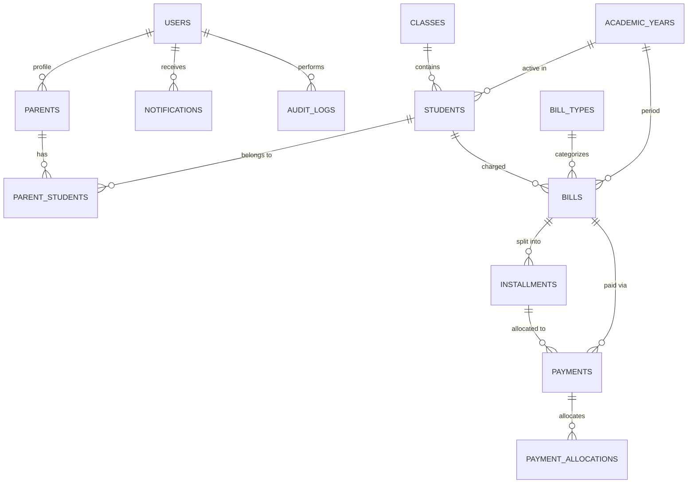

# SPP-Ku: Sistem Pembayaran SPP Sekolah

> **Platform Manajemen Tagihan & Pembayaran SPP Sekolah Modern Berbasis Web**  
> Dibangun dengan Next.js, InsForge / Prisma ORM, PostgreSQL / SQLite, TypeScript, dan Tailwind CSS.

---

## 1. Ringkasan Proyek

**SPP-Ku** adalah aplikasi web modern, responsif, dan mudah digunakan yang dirancang khusus untuk mempermudah sekolah dalam mengelola tagihan dan pembayaran biaya pendidikan (SPP, Uang Gedung, Seragam, Kegiatan, dll), serta memberikan kemudahan bagi orang tua/wali siswa dalam memantau tagihan, mengikuti jadwal cicilan yang ditentukan admin, melakukan pembayaran digital, dan mengunduh bukti pembayaran resmi (kwitansi digital).

### Prinsip Utama Sistem:
1. **Aturan Cicilan Ketat**: Fitur cicilan **sepenuhnya diatur dan dikontrol oleh Admin Sekolah**. Orang tua siswa **tidak diizinkan** membuat, mengubah nominal, atau menggeser tanggal jatuh tempo cicilan sendiri. Orang tua hanya membayar sesuai skema cicilan resmi yang telah ditetapkan sekolah.
2. **Perhitungan Keuangan Presisi**: Seluruh nominal uang disimpan dan dihitung dalam bilangan bulat (integer Rupiah - IDR) tanpa floating-point JavaScript untuk mencegah selisih pembulatan.
3. **Multi-Anak (Multi-Student Support)**: Satu akun orang tua dapat menaungi lebih dari satu anak dan dapat beralih akun anak (*student switcher*) secara instan.
4. **Idempotent Payment Gateway**: Arsitektur pembayaran siap integrasi (QRIS, Virtual Account, Transfer Bank, Tunai/Manual) dengan simulator sandbox dan callback idempotent untuk mencegah duplikasi transaksi.
5. **Audit Trail Lengkap**: Setiap tindakan perubahan tagihan, cicilan, dan pencatatan kasir tercatat dalam *Audit Log*.

---

## 2. Stack Teknologi & Arsitektur

| Komponen | Teknologi | Keterangan |
|---|---|---|
| **Framework Utama** | Next.js 15+ (App Router) | Server Components, Server Actions, & Route Handlers |
| **Bahasa Pemrograman** | TypeScript | Type safety end-to-end |
| **Backend & BaaS** | InsForge (`@insforge/sdk`) / Prisma ORM | Manajemen database PostgreSQL / SQLite & API layer |
| **Styling & Design System** | Tailwind CSS + Lucide Icons | Desain responsif mobile-first dan desktop dashboard |
| **Autentikasi & Otorisasi** | Role-Based Access Control (RBAC) | Role `ADMIN` & `PARENT` dengan proteksi middleware |
| **Validasi Data** | Zod Schema Validation | Validasi input ketat pada API dan form frontend |
| **Abstraksi Pembayaran** | Payment Service Interface & Mock Sandbox | Simulasi QRIS, Virtual Account (BCA, BNI, BRI, Mandiri), Transfer Bank, dan Tunai |
| **Zona Waktu & Format** | `Asia/Jakarta` (WIB) & Rupiah (`IDR`) | Format tanggal lokal Indonesia (e.g. *10 Juli 2026*) |

---

## 3. Peran Pengguna & Modul Sistem

### A. Role: Admin Sekolah (Desktop-Optimized Dashboard)
Sidebar Menu Admin:
1. **Dashboard**: Ringkasan statistik (Total siswa, total tagihan bulan ini, pembayaran diterima, total piutang/tunggakan, jumlah siswa belum bayar), grafik arus kas bulanan, dan tabel pembayaran terbaru.
2. **Data Siswa**: CRUD Siswa (NIS, NISN, nama lengkap, jenis kelamin, kelas, tahun ajaran, kontak ortu, status aktif) dan fitur penautan akun orang tua.
3. **Kelas**: Manajemen tingkat dan kelas (e.g., X MIPA 1, XI IPS 2).
4. **Tahun Ajaran**: Manajemen semester dan penentuan tahun ajaran aktif.
5. **Tagihan**: Pembuatan tagihan per siswa, per kelas, atau borongan semua siswa (SPP bulanan, uang gedung, seragam, dll) beserta status (*Belum Bayar, Cicilan Berjalan, Lunas, Terlambat*).
6. **Cicilan (Installment Management)**:
   - Membuat skema cicilan (jumlah termin, nominal per termin, jatuh tempo per termin).
   - Validasi: Total cicilan = Total tagihan, nominal cicilan > 0.
   - Proteksi: Cicilan yang telah memiliki pembayaran tidak dapat dihapus sembarangan.
7. **Pembayaran**: Log seluruh transaksi masuk & fitur **Pencatatan Pembayaran Manual** (Tunai/Transfer Kasir) dengan identitas admin pencatat.
8. **Tunggakan**: Daftar siswa dengan tagihan atau cicilan yang melewati jatuh tempo beserta kalkulasi hari keterlambatan.
9. **Laporan**: Laporan penerimaan harian, bulanan, per kelas, per siswa, per jenis tagihan, daftar tunggakan, dan piutang sekolah lengkap dengan filter, ekspor CSV, dan opsi cetak.
10. **Notifikasi**: Pusat monitoring pengiriman notifikasi sistem (tagihan baru, reminder H-3 jatuh tempo, konfirmasi bayar).
11. **Pengaturan & Audit Log**: Konfigurasi identitas sekolah (kop surat, logo, kepala sekolah, bendahara) dan log riwayat mutasi finansial.

---

### B. Role: Orang Tua / Wali Siswa (Mobile-First Portal)
Navigasi Mobile & Desktop:
1. **Beranda**:
   - Pemilih anak (*Student Switcher*) jika memiliki > 1 anak.
   - Kartu ringkasan tagihan: Total tagihan, total terbayar, sisa piutang.
   - Progress bar pembayaran: *"Rp2.000.000 dari Rp3.000.000 telah dibayar — 67%"*.
   - Tagihan & cicilan jatuh tempo terdekat dengan tombol cepat **"Bayar Sekarang"**.
2. **Tagihan**:
   - Daftar tagihan aktif dan lunas.
   - Detail tagihan dengan **Timeline Cicilan Terstruktur**:
     - *Cicilan 1 — Rp1.000.000 — Lunas ✓ (10 Juli 2026)*
     - *Cicilan 2 — Rp1.000.000 — Belum Bayar (10 Agustus 2026) [Bayar Sekarang]*
     - *Cicilan 3 — Rp1.000.000 — Belum Bayar (10 September 2026)*
3. **Riwayat Pembayaran**:
   - Daftar transaksi pembayaran berhasil beserta tombol **Unduh / Cetak Bukti Pembayaran Digital (Kwitansi)**.
4. **Notifikasi**:
   - Kotak masuk pengingat tagihan baru, batas jatuh tempo, dan status transaksi.
5. **Profil**:
   - Informasi akun orang tua, kontak, dan data anak-anak terdaftar.

---

## 4. Skema Database Relasional



### Rincian Tabel Utama:
1. **`users`**: `id (UUID)`, `email`, `password_hash`, `name`, `phone`, `role (ADMIN | PARENT)`, `is_active`, `created_at`, `updated_at`.
2. **`parents`**: `id (UUID)`, `user_id`, `nik`, `address`, `occupation`, `created_at`, `updated_at`.
3. **`students`**: `id (UUID)`, `nis`, `nisn`, `full_name`, `gender`, `class_id`, `academic_year_id`, `address`, `status (ACTIVE | GRADUATED | INACTIVE)`.
4. **`parent_students`**: `parent_id`, `student_id`, `relationship (AYAH | IBU | WALI)`.
5. **`classes`**: `id (UUID)`, `name`, `grade`, `academic_year_id`.
6. **`academic_years`**: `id (UUID)`, `name`, `semester (GANJIL | GENAP)`, `is_current`, `start_date`, `end_date`.
7. **`bill_types`**: `id (UUID)`, `code`, `name`, `description`, `is_installment_allowed`, `default_amount`.
8. **`bills`**: `id (UUID)`, `bill_number`, `student_id`, `bill_type_id`, `academic_year_id`, `title`, `total_amount`, `paid_amount`, `remaining_amount`, `status (UNPAID | PARTIAL | PAID | OVERDUE)`, `due_date`, `allow_installment`, `notes`, `created_by_id`.
9. **`installments`**: `id (UUID)`, `bill_id`, `installment_number`, `amount`, `paid_amount`, `remaining_amount`, `due_date`, `status (UNPAID | PAID | OVERDUE)`, `notes`.
10. **`payments`**: `id (UUID)`, `payment_number`, `bill_id`, `installment_id`, `student_id`, `amount`, `payment_method (QRIS | VA_BCA | VA_BNI | VA_BRI | VA_MANDIRI | BANK_TRANSFER | CASH)`, `status (PENDING | SUCCESS | FAILED | EXPIRED | CANCELLED)`, `reference_number`, `paid_at`, `expires_at`, `recorded_by_id`, `notes`.
11. **`payment_allocations`**: `id (UUID)`, `payment_id`, `bill_id`, `installment_id`, `allocated_amount`.
12. **`notifications`**: `id (UUID)`, `user_id`, `title`, `message`, `type`, `is_read`, `link_url`, `created_at`.
13. **`audit_logs`**: `id (UUID)`, `user_id`, `action`, `entity_type`, `entity_id`, `before_data (JSON)`, `after_data (JSON)`, `ip_address`, `created_at`.
14. **`school_settings`**: `id (UUID)`, `school_name`, `school_npsn`, `school_address`, `school_phone`, `school_email`, `school_logo`, `principal_name`, `treasurer_name`.

---

## 5. Alur Pembayaran & Mock Sandbox

```
[Orang Tua Memilih Tagihan / Cicilan]
                   │
                   ▼
       [Klik "Bayar Sekarang"]
                   │
                   ▼
       [Pilih Metode Pembayaran]
  (QRIS / Virtual Account / Transfer)
                   │
                   ▼
[Generate Transaksi & Kode Pembayaran]
                   │
                   ▼
    [Simulator Sandbox Gateway]
  (Tombol: "Simulasikan Bayar Berhasil")
                   │
                   ▼
  [Webhook Idempotent Handler API]
                   │
       ┌───────────┴───────────┐
       ▼                       ▼
[Update Status         [Generate Kwitansi Digital
 Installment/Bill]       & Kirim Notifikasi]
```

---

## 6. Format Bukti Pembayaran Resmi (Kwitansi Digital)

Kwitansi digital memuat informasi terstandarisasi:
* **Kop & Identitas Sekolah**: Logo sekolah, nama sekolah, NPSN, alamat, dan nomor kontak.
* **Metadata Transaksi**: Nomor transaksi resmi (`TRX-YYYYMMDD-XXXX`), tanggal & waktu pembayaran.
* **Data Siswa**: Nama lengkap, Nomor Induk Siswa (NIS), kelas.
* **Rincian Pembayaran**: Nama tagihan, termin cicilan (contoh: *Cicilan Ke-1 dari 3*), nominal pembayaran, metode pembayaran, nomor referensi.
* **Status**: Badge cap digital hijau **LUNAS / BERHASIL**.
* **Pengesahan**: Tanda tangan digital Bendahara / Kepala Sekolah dan tombol cetak/PDF langsung.

---

## 7. Keamanan & Best Practices

1. **Role-Based Middleware**: Semua endpoint API memvalidasi role user di server-side. Orang tua hanya dapat mengakses data siswa miliknya.
2. **Kalkulasi Atomic Finansial**: Eksekusi pembayaran dan alokasi saldo menggunakan database transaction untuk mencegah race condition.
3. **Sanitasi & Validasi Input**: Seluruh input form disaring menggunakan schema Zod.
4. **Audit Trail Otomatis**: Setiap aksi pembuatan tagihan, perubahan cicilan, atau pencatatan kasir manual terekam pada audit log.

---

## 8. Data Demo / Seed Awal

Untuk memudahkan pengujian langsung:
* **Admin**: `admin@sekolah.id` / `admin123`
* **Orang Tua 1 (2 Anak)**: `orangtua1@gmail.com` / `ortu123` (Siswa: Ahmad Fauzi - X MIPA 1, Siti Fauziah - XI IPS 1)
* **Orang Tua 2**: `orangtua2@gmail.com` / `ortu123` (Siswa: Budi Pratama - X MIPA 2)
* **Orang Tua 3**: `orangtua3@gmail.com` / `ortu123` (Siswa: Citra Kirana - XII MIPA 1)
* **Varian Tagihan**: SPP Bulanan (Lunas & Belum Bayar), Uang Gedung (Skema 3x Cicilan), Seragam (Terlambat).

---

## 9. Panduan Memulai Proyek

```bash
# 1. Instalasi dependensi
npm install

# 2. Setup Environment & Database
cp .env.example .env
npx prisma generate
npx prisma db push
npx prisma db seed

# 3. Jalankan server pengembangan
npm run dev
```
Akses di browser pada `http://localhost:3000`.
